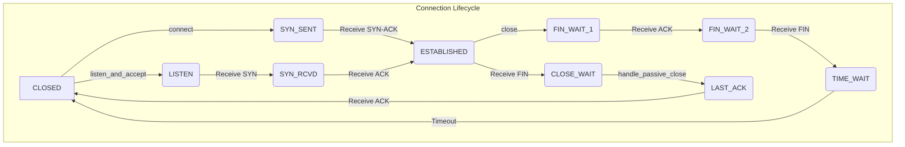

# Styx Protocol


**Styx** is a custom transport protocol built on top of UDP in Rust, engineered to provide TCP-like reliability and connection management. This project was born from a desire to deeply understand the mechanics of network protocols by building one from the ground up.

It's more than just code; it's a journey through the challenges of packet loss, sequencing, and state management that underpin modern computer networks.

## Core Features

- **Connection-Oriented Communication**: Implements a full 3-way handshake for connection establishment and a 4-way handshake for graceful teardown, mimicking TCP's robust session management.
- **Guaranteed Packet Delivery**: Utilizes a Stop-and-Wait Automatic Repeat reQuest (ARQ) mechanism. Every data packet must be acknowledged, or it will be retransmitted, ensuring no data is lost.
- **High-Level Abstraction**: Provides a clean, intuitive `StyxSocket` API that simplifies network programming, allowing developers to `connect`, `send`, `recv`, and `close` without worrying about the underlying protocol complexity.
- **Practical Demonstration**: Comes with a fully functional client-server application that demonstrates a reliable file transfer, proving the protocol's capabilities in a real-world scenario.

## Architecture Overview

The Styx protocol is built on two primary components:

1.  **`StyxPacket`**: The fundamental unit of data transmission. Each packet contains a header with sequence/acknowledgment numbers and flags (SYN, ACK, FIN), plus a payload. This structure is essential for managing the connection state and ensuring data integrity.

2.  **`StyxSocket`**: The main API for interacting with the protocol. It encapsulates a `UdpSocket` and manages the complex state machine required for connection lifecycle, sequencing, and reliability.

### Connection State Machine

The protocol's logic is governed by a state machine that tracks the connection status. This ensures that both client and server have a synchronized understanding of the session.



### API in Action

Here's how simple it is to use the `StyxSocket` API to build a client:

```rust
// Example: Client-side connection and send
use Styx::styx_socket::StyxSocket;

fn main() -> std::io::Result<()> {
    // Connect to the server (3-way handshake happens here)
    let mut connection = StyxSocket::connect("127.0.0.1:8081")?;

    // Send data reliably (Stop-and-Wait happens here)
    connection.send(b"Hello, Styx!")?;

    // Close the connection (4-way handshake happens here)
    connection.close()?;

    Ok(())
}
```

## Getting Started

### Prerequisites

- [Rust](https://www.rust-lang.org/tools/install) (latest stable version)

### Running the File Transfer Demo

1.  **Clone the repository:**
    ```sh
    git clone https://github.com/0xReLogic/Styx.git
    cd Styx
    ```

2.  **Run the server:**
    Open a terminal and run:
    ```sh
    cargo run --bin server
    ```

3.  **Run the client:**
    In a separate terminal, run:
    ```sh
    cargo run --bin client
    ```
    The client will transfer `sample.txt` to the server, which saves it as `received_sample.txt`.

## How to Contribute

We welcome contributions! Please see our [CONTRIBUTING.md](CONTRIBUTING.md) for details on how to get started.

## License

This project is licensed under the MIT License - see the [LICENSE](LICENSE) file for details.

---
Made with ❤️ by Allen Elzayn
